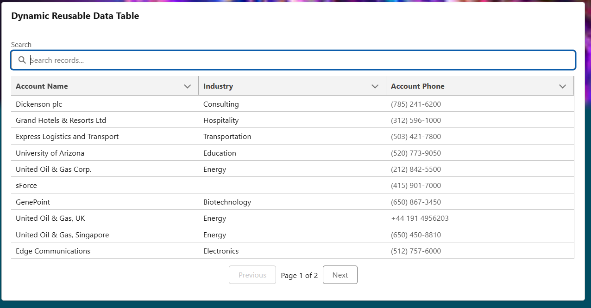

# Dynamic Reusable Data Table for Salesforce LWC  
### A Universal, Metadata-Driven Lightning Datatable Component

This project provides a fully **dynamic, reusable, and configurable Lightning Web Component (LWC)** that can display **any Salesforce object’s data** — Standard or Custom — without writing additional UI code.

It uses **dynamic SOQL**, **schema metadata**, and **FLS-enforced querying** to generate:
- Dynamic columns with correct labels & data types  
- Dynamic rows from any SObject  
- Client-side search  
- Client-side pagination (10 rows per page)  
- “No records found” handling  
- Toast notifications (success, error, info)  
- Clean, scalable architecture  

Perfect for developers, admins, architects, and managed packages needing a **universal record browser**.

---

## 📸 Demo Screenshot

